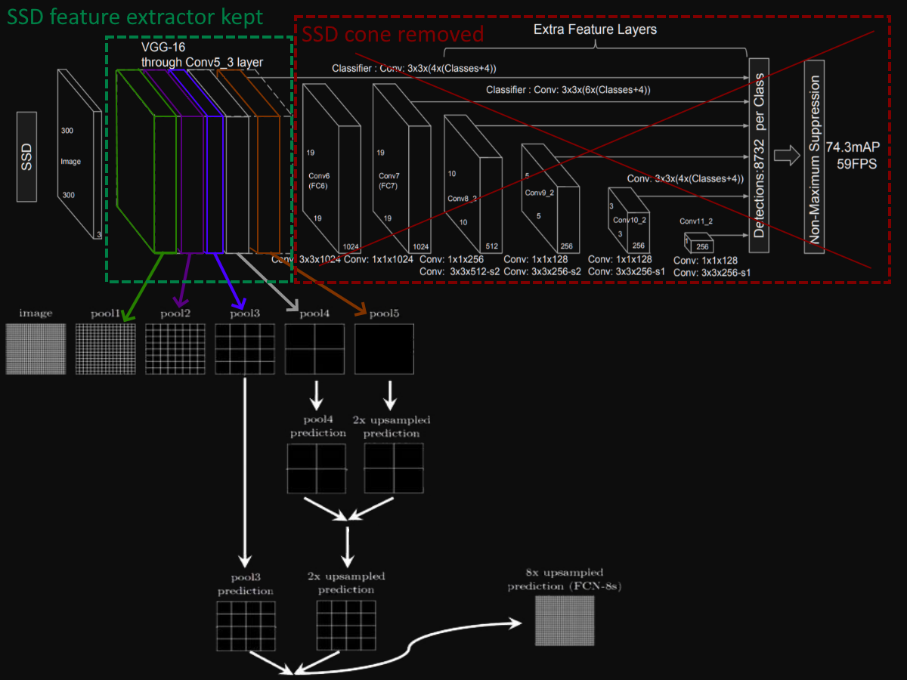
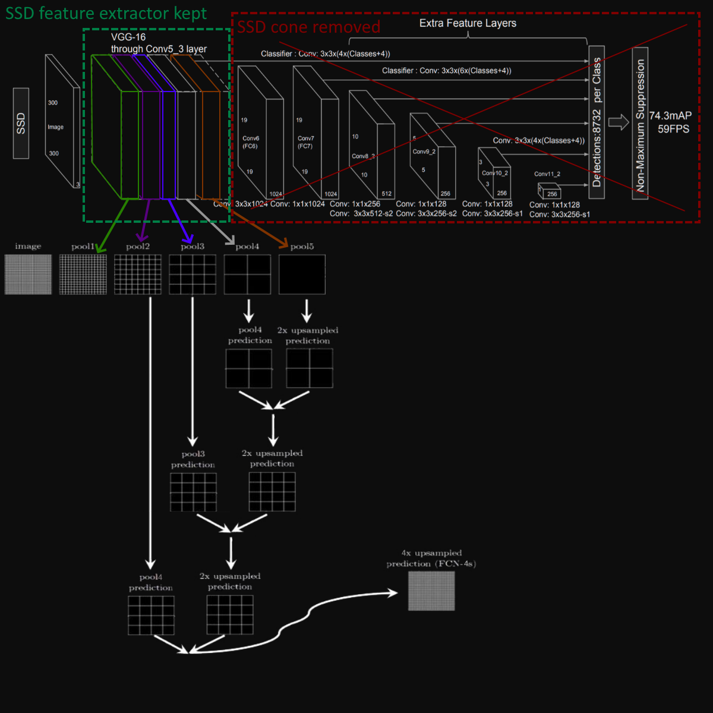

# Image segmentation project

The full project is explained [here](https://apiquet.com/2021/01/03/segmentation-model-implementation/)

In this repository is implemented two architectures:

* VGG-16 + FCN-8 module. We use pre-trained weights from SSD300 implemented [here](https://github.com/Apiquet/Tracking_SSD_ReID)
Although the SSD300 is designed for object detection, its feature extractor can be reused in another task involving similar classes.
The related article at the top of this readme explains the implementation and compares training with and without learning transfer.

* FCN-8 architectures and some results:

* FCN-4 architectures and some results:

* U-NET architecture and some results: [paper](https://arxiv.org/pdf/1505.04597.pdf)

